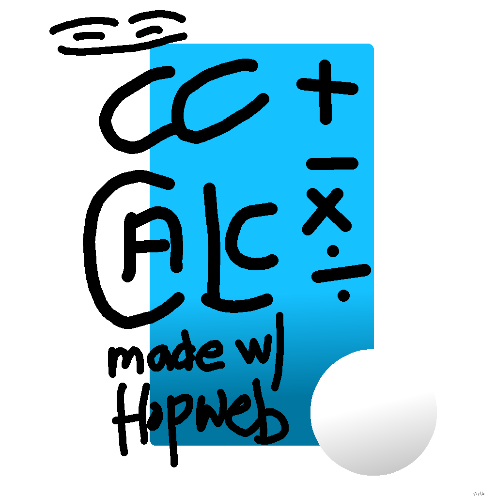
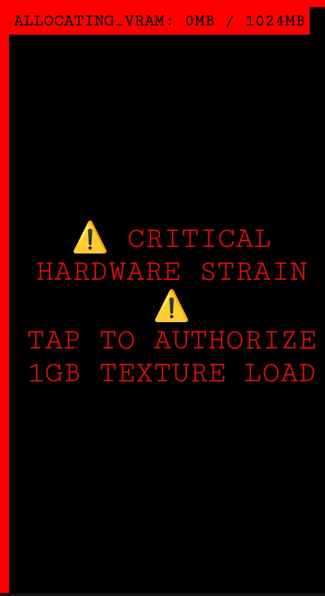

# 🟦 MCC_CALC Distribution

<div style="background-color: #04080f; color: #d1d9e6; font-family: sans-serif; padding: 20px; border-radius: 15px;">

  <div style="display: flex; align-items: center; margin-bottom: 20px;">
    
    <div>
      <h1 style="margin: 0; color: #fff; font-size: 1.5rem;">Mcc Calculator</h1>
      <p style="margin: 0; color: #00a2ff; font-weight: bold; font-size: 0.9rem;">projdenutch</p>
    </div>
  </div>

  <p style="color: #8fa3b6; font-size: 0.95rem; line-height: 1.5;">
    Experience high-frequency mathematical operations and system-level efficiency. This suite is designed for zero-latency calculation on native architecture.
  </p>

  <p style="font-weight: bold; color: #fff; margin-bottom: 10px;">Screenshots:</p>
  <div style="display: flex; gap: 10px; overflow-x: auto; padding-bottom: 10px;">
    
    
    
    
    
  </div>

  <div style="text-align: center; margin: 30px 0;">
    <a href="cc.calc.zip" style="background-color: #00a2ff; color: #04080f; padding: 12px 30px; border-radius: 20px; text-decoration: none; font-weight: bold; display: inline-block;">Download ZIP</a>
  </div>

  <div style="background-color: #0c121d; padding: 20px; border-radius: 15px; border: 1px solid #16253d;">
    <h3 style="margin-top: 0; color: #00a2ff;">¿Info?</h3>
    <p style="font-size: 0.85rem; color: #6d7f99; margin-bottom: 0;">
      The MCC Calculator utilizes an optimized kernel to handle complex arithmetic. This build ensures maximum CPU priority for arithmetic processing.
    </p>
  </div>

  <div style="margin-top: 20px; text-align: center; font-size: 0.75rem; color: #4a5a75;">
    ©2026 ccNutch | Absolute Route: 0/Venter/Hopweb/Proj/mainsuite/
  </div>

</div>

---

### 💻 Development Source
To modify the behavior of the landing page, edit the script in `index.html`.

```javascript
// Current Configuration
const appn = "Mcc Calculator";
const lg   = "logo.png"; 
const scs  = ["screenshot1.png", "screenshot2.png", "screenshot3.png", "screenshot4.png", "screenshot5.png"]; 
